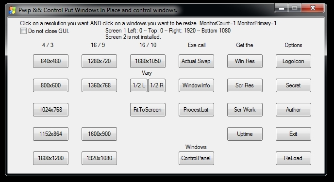
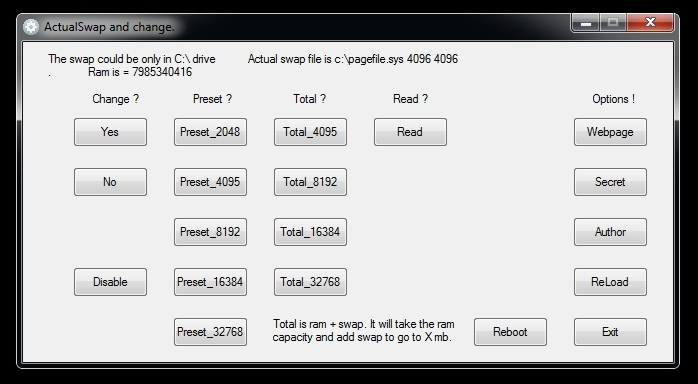
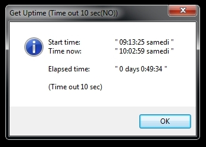
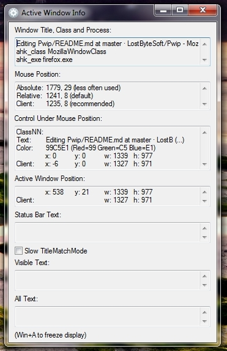
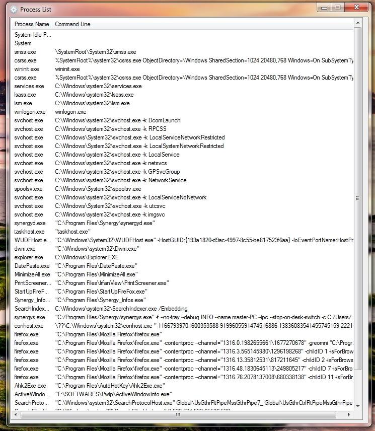

# Pwip & Control
Click on a resolution you want AND click on a windows you want to be resize. Popular resolutions reseize.

Include some easy access of control windows.

This software is usefull to place automaticly a windows in a specified resolution. Usefull for windows doesn't have the ability to do this.

This entire thing (work) is a developpement tool for AHK scripting. And i use it for testing purposes.

